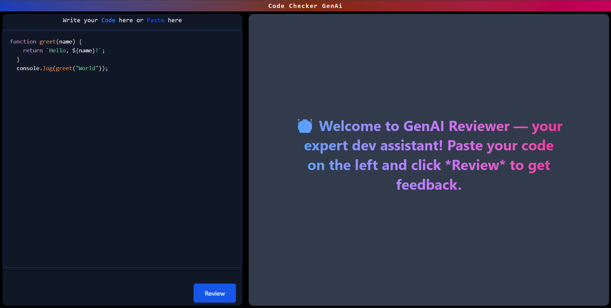

# 🤖 GenAI Code Reviewer

A full-stack **AI-powered code review tool** that helps developers instantly analyze and improve their code.  
This project uses **Google Gemini AI** as the reviewer engine, with a **Node.js/Express backend** and a modern **React + TailwindCSS frontend**.

---
## Live in Air
- **CodeChecker.Ai.co**[https://codecheck-ai-co.onrender.com]

## ✨ Features

- 🔗 **Backend**: Node.js + Express + Google Gemini AI integration  
- 🎨 **Frontend**: React, TailwindCSS, React-Markdown, Highlight.js  
- ⌨️ **Live Code Editor** – write or paste your code and review instantly  
- 📝 **AI Review System** – Gemini provides code analysis, suggestions & improvements  
- 🎭 **Markdown Support** – beautifully styled AI responses with syntax highlighting  
- ⚡ **Smooth UX** – loader animations, welcome screen, smooth scrolling, and responsive layout  

---

## 🚀 Tech Stack

**Frontend**  
- React (Vite)  
- TailwindCSS  
- React-Markdown  
- Highlight.js  

**Backend**  
- Node.js + Express  
- Axios  
- Google Gemini AI API (via system instructions)  

---

## 📸 Screenshots

### 🏠 Home / Editor

---
git clone https://github.com/your-username/genai-code-reviewer.git
cd genai-code-reviewer
